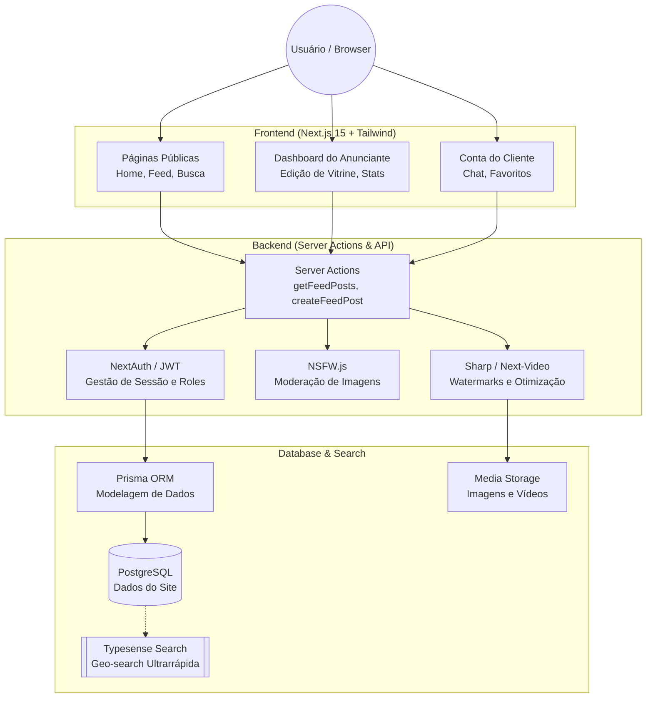

# Arquitetura Técnica - Babalux (Califado VIP)

Este diagrama descreve o fluxo de dados e a integração entre os componentes do sistema.

## Componentes Principais

### Frontend
- **Framework:** Next.js 15 (App Router)
- **Estilo:** Tailwind CSS
- **Componentes:** Radix UI / Shadcn UI
- **Animações:** Framer Motion

### Backend & Lógica
- **Autenticação:** NextAuth.js (com Roles flexíveis)
- **Moderação:** NSFW.js integrada no pipeline de upload
- **Processamento de Imagem:** Sharp para conversão WebP e marcas d'água
- **Vídeo:** Vercel / Next-Video

### Dados & Busca
- **ORM:** Prisma
- **Motor de Busca:** Typesense (específico para busca geográfica e filtros em tempo real)
- **Infra:** PostgreSQL local/nuvem
