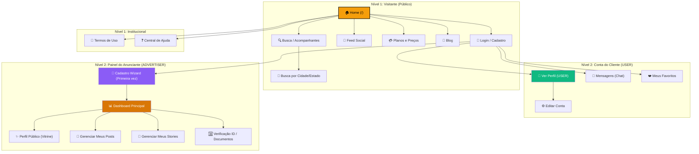

# Árvore de Navegação (Sitemap) - Babalux

Este documento descreve a hierarquia de páginas e o fluxo de caminhos do site para visitantes, clientes e anunciantes.

## Resumo das Conexões

1. **Visitante:** Pode acessar todas as páginas do Nível 1.
2. **Cliente Logado:** Acessa as funções de interação (Chat, Favoritos).
3. **Anunciante:** O conteúdo inserido no dashboard (Nível 2) alimenta o que o Visitante vê no Nível 1 (Perfil e Feed).
